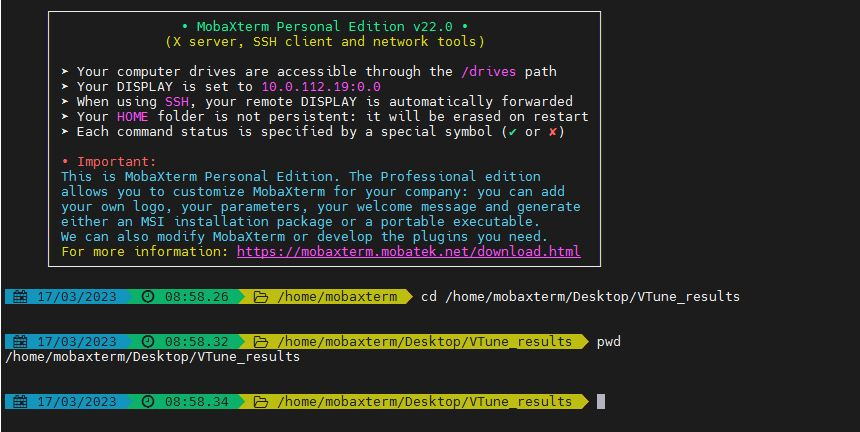
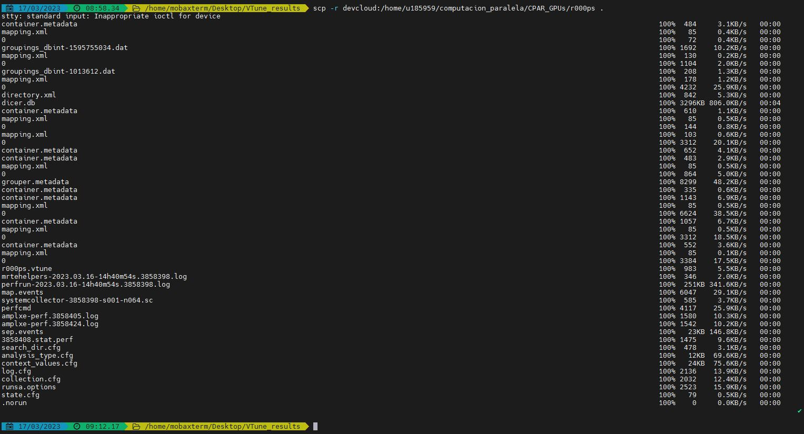
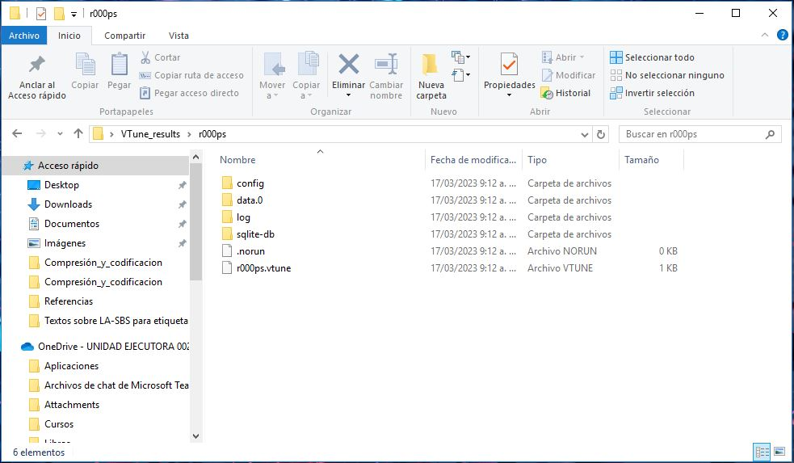
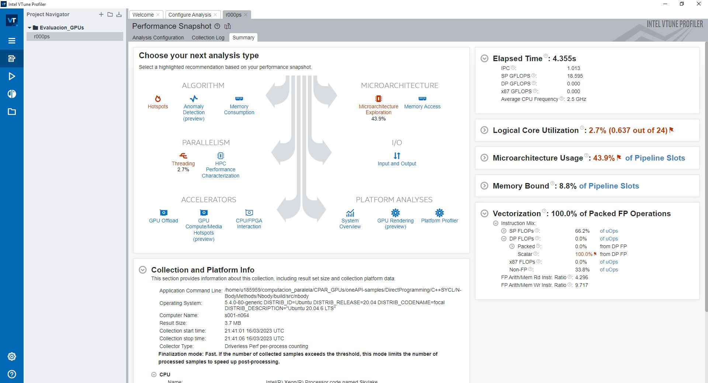
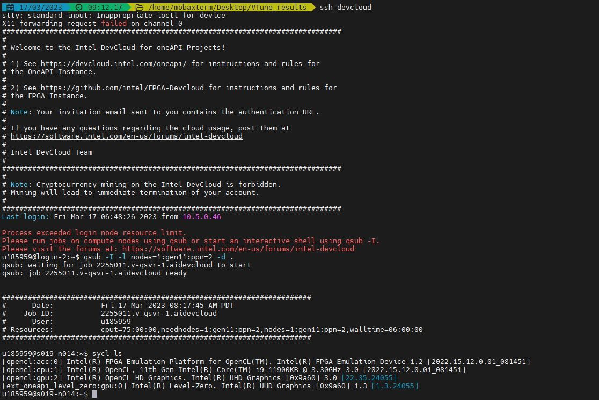
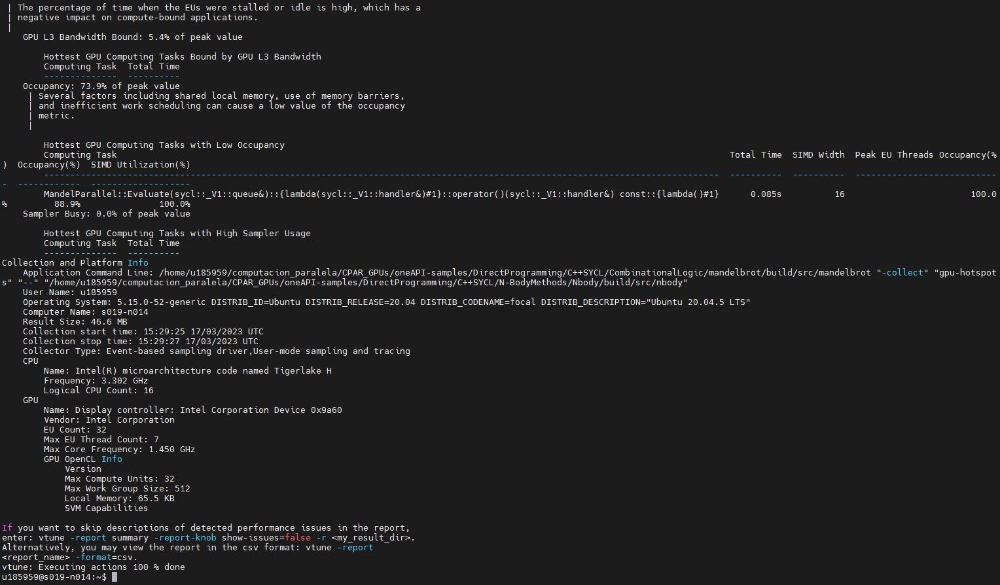
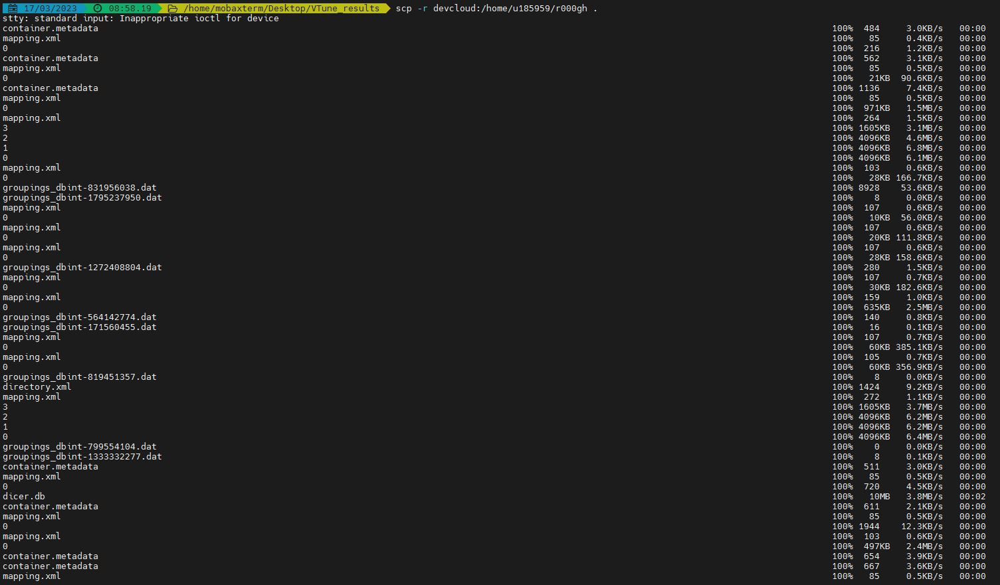
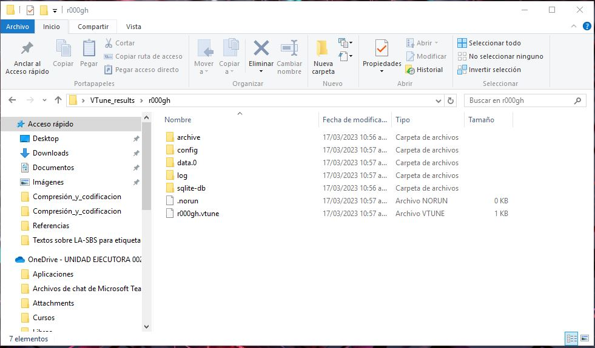
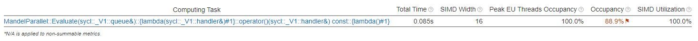
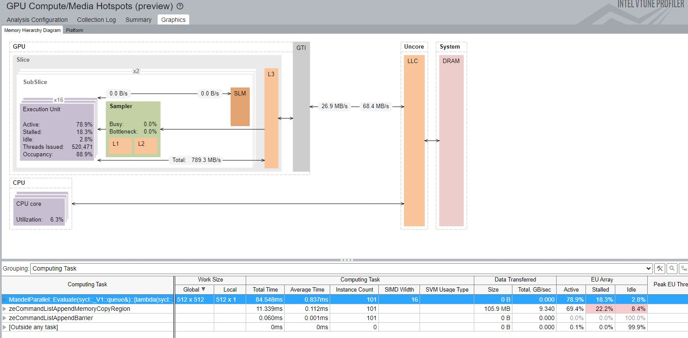

# Evaluación del curso "Computación Paralela con GPU's"

**AUTOR: Daniel A. Urcia Paredes**

A continuación, se desarrollan cada una de las actividades solicitadas.

## 0. Clonar el repositorio "oneAPI-samples" [1 punto]

Para ello, se accederá a través de los comandos que nos ofrece git. Primero, veremos la ubicación actual:

`!cd /home/u185959`

Procediendo a clonar con "git clone"

`!git clone https://github.com/oneapi-src/oneAPI-samples`

```
Cloning into 'oneAPI-samples'...
remote: Enumerating objects: 24959, done.
remote: Counting objects: 100% (419/419), done.
remote: Compressing objects: 100% (276/276), done.
remote: Total 24959 (delta 176), reused 328 (delta 134), pack-reused 24540
Receiving objects: 100% (24959/24959), 256.67 MiB | 3.56 MiB/s, done.
Resolving deltas: 100% (16320/16320), done.
Updating files:  45% (1556/3457)
```

## 1. Cambiar al directorio del ejemplo "NBody" [1 punto]
- Directorio: `oneAPI-samples/tree/master/DirectProgramming/C++SYCL/N-BodyMethods/Nbody`

Para ellos cambiamos el directorio con el comando "cd"

`cd oneAPI-samples/DirectProgramming/C++SYCL/N-BodyMethods/Nbody`

```
/home/u185959/computacion_paralela/CPAR_GPUs/oneAPI-samples/DirectProgramming/C++SYCL/N-BodyMethods/Nbody
```

Verificando la ubicación actual:

`pwd`

```
'/home/u185959/computacion_paralela/CPAR_GPUs/oneAPI-samples/DirectProgramming/C++SYCL/N-BodyMethods/Nbody'
```

## 2. Explicar brevemente el algoritmo de `Nbody` [3 puntos]

El algoritmo de **NBody** refiere a una clase de métodos de simulación que permiten modelar el comportamiento de un sistema físico utilizando un conjunto de entidades discretas como átomos, cuerpos astrofísicos, etc., y un conjunto de interacciones entre ellos denominados **potenciales de acoplamiento**, tales como la fuerza, aceleración, velocidad, posición, entre otros, las cuales dependen del tiempo. Este algoritmo es muy paralelo a los datos, por lo que el código se adecua muy bien para ejecutarlo en un GPU, además demuestra cómo lidiar con varios núcleos de dispositivos que se pueden poner en una cola SYCL para su ejecución.

## 3. Acceder en modo interactivo a un nodo de cómputo con GPUs (`gen9` o `gen11`) [3 puntos]
- Compilar y ejecutar `Nbody`
- Proporcionar screenshot(s) de los resultados
- Por cada screenshot, añadir una breve descripción

En este punto, primero se debe acceder al nodo en modo interactivo, para ello se ha escogido el gen11.

`!qsub -I -l nodes=1:gen11:ppn=2 -d .`

```
qsub: waiting for job 2254252.v-qsvr-1.aidevcloud to start
qsub: job 2254252.v-qsvr-1.aidevcloud ready


########################################################################
#      Date:           Thu 16 Mar 2023 12:11:51 PM PDT
#    Job ID:           2254252.v-qsvr-1.aidevcloud
#      User:           u185959
# Resources:           cput=75:00:00,neednodes=1:gen11:ppn=2,nodes=1:gen11:ppn=2,walltime=06:00:00
########################################################################

]0;u185959@s019-n008: ~/computacion_paralela/CPAR_GPUs/oneAPI-samples/DirectProgramming/C++SYCL/N-BodyMethods/Nbodyu185959@s019-n008:~/computacion_paralela/CPAR_GPUs/oneAPI-samples/DirectProgramming/C++SYCL/N-BodyMethods/Nbody$ 
```
Una vez conectado al nodo, se verificará qué dispositivos soporta:

`!sycl-ls`

```
[opencl:acc:0] Intel(R) FPGA Emulation Platform for OpenCL(TM), Intel(R) FPGA Emulation Device 1.2 [2022.15.12.0.01_081451]
[opencl:cpu:1] Intel(R) OpenCL, Intel(R) Xeon(R) Gold 6128 CPU @ 3.40GHz 3.0 [2022.15.12.0.01_081451]
```

Lo que se observa es que este nodo dispone de un acelerador FPGA y un CPU Intel Xeon.

**Compilando y ejecutando "NBody"**

Construyendo el programa:

`mkdir build`

`cd build`

```
/home/u185959/computacion_paralela/CPAR_GPUs/oneAPI-samples/DirectProgramming/C++SYCL/N-BodyMethods/Nbody/build
!cmake ..
```

`!cmake ..`

```
-- The C compiler identification is GNU 9.4.0
-- The CXX compiler identification is Clang 16.0.0
-- Check for working C compiler: /usr/bin/cc
-- Check for working C compiler: /usr/bin/cc -- works
-- Detecting C compiler ABI info
-- Detecting C compiler ABI info - done
-- Detecting C compile features
-- Detecting C compile features - done
-- Check for working CXX compiler: /glob/development-tools/versions/oneapi/2023.0.1/oneapi/compiler/2023.0.0/linux/bin/icpx
-- Check for working CXX compiler: /glob/development-tools/versions/oneapi/2023.0.1/oneapi/compiler/2023.0.0/linux/bin/icpx -- works
-- Detecting CXX compiler ABI info
-- Detecting CXX compiler ABI info - done
-- Detecting CXX compile features
-- Detecting CXX compile features - done
-- Configuring done
-- Generating done
-- Build files have been written to: /home/u185959/computacion_paralela/CPAR_GPUs/oneAPI-samples/DirectProgramming/C++SYCL/N-BodyMethods/Nbody/build
```

`!make`

```
Scanning dependencies of target nbody
[ 33%] Building CXX object src/CMakeFiles/nbody.dir/GSimulation.cpp.o
[ 66%] Building CXX object src/CMakeFiles/nbody.dir/main.cpp.o
[100%] Linking CXX executable nbody
[100%] Built target nbody
```

Ejecutando el programa:

`!make run`

```
Scanning dependencies of target run
===============================
 Initialize Gravity Simulation
 nPart = 16000; nSteps = 10; dt = 0.1
------------------------------------------------
 s       dt      kenergy     time (s)    GFLOPS      
------------------------------------------------
 1       0.1     26.405      0.96413     7.7005      
 2       0.2     313.77      0.025533    290.78      
 3       0.3     926.56      0.016176    458.98      
 4       0.4     1866.4      0.015141    490.34      
 5       0.5     3135.6      0.015565    476.98      
 6       0.6     4737.6      0.015174    489.29      
 7       0.7     6676.6      0.015117    491.12      
 8       0.8     8957.7      0.01513     490.72      
 9       0.9     11587       0.016008    463.79      
 10      1       14572       0.015962    465.11      

# Total Time (s)     : 1.1142
# Average Performance : 478.29 +- 12.96
===============================
Built target run
```

**Breves descripciones de los resultados**

CMake a través de sus comando **!cmake ..** y **make**, como sistema de generación de scripts para el entorno de trabajo utilizado genera los archivos necesarios para la ejecución del algoritmo y los guarda en la dirección "/home/u185959/computacion_paralela/CPAR_GPUs/oneAPI-samples/DirectProgramming/C++SYCL/N-BodyMethods/Nbody/build". Luego, permite correr los archivos ejecutables generados anteriormente que contienen el algoritmo **NBody**.

Este algoritmo inicia la simulación de la gravedad con un número de partículas (nPart) igual a 16000, considera también 10 pasos de integración (nSteps) y 
un diferencial de tiempo (dt) igual a 0.1. El cálculo de los parámetros depende de las "nParts-1" partículas restantes. Se observa en la tabla de resultados que, a medida que el tiempo transcurre, el sistema de partículas aumenta su energía y el consumo computacional en promedio aumenta y se acerca a medio teraflop.

## 4. Realizar un análisis de _**GPU Hotspots**_ con VTune [8 puntos]
- Indicar los hotspots del programa
- Proporcionar screenshot(s) de los resultados
- Por cada screenshot, añadir una breve descripción

Para ello, ubicamos el archivo binario generado por la compilacion del código fuente del algoritmo

`!vtune -collect performance-snapshot -- /home/u185959/computacion_paralela/CPAR_GPUs/oneAPI-samples/DirectProgramming/C++SYCL/N-BodyMethods/Nbody/build/src/nbody`

```
vtune: Peak bandwidth measurement started.
vtune: Peak bandwidth measurement finished.
vtune: Collection started. To stop the collection, either press CTRL-C or enter from another console window: vtune -r /home/u185959/computacion_paralela/CPAR_GPUs/r000ps -command stop.
===============================
 Initialize Gravity Simulation
 nPart = 16000; nSteps = 10; dt = 0.1
------------------------------------------------
 s       dt      kenergy     time (s)    GFLOPS      
------------------------------------------------
 1       0.1     26.405      0.76754     9.6728      
 2       0.2     313.77      0.026696    278.1       
 3       0.3     926.56      0.016498    450.02      
 4       0.4     1866.4      0.015813    469.52      
 5       0.5     3135.6      0.015798    469.95      
 6       0.6     4737.6      0.015743    471.58      
 7       0.7     6676.6      0.01578     470.5       
 8       0.8     8957.7      0.015904    466.81      
 9       0.9     11587       0.015812    469.53      
 10      1       14572       0.015564    477.01      

# Total Time (s)     : 0.9214
# Average Performance : 468.11 +- 7.3575
===============================
vtune: Collection stopped.
vtune: Using result path `/home/u185959/computacion_paralela/CPAR_GPUs/r000ps'
vtune: Executing actions 75 % Generating a report                              Elapsed Time: 4.355s
    IPC: 1.013
    SP GFLOPS: 18.595
    DP GFLOPS: 0.000
    x87 GFLOPS: 0.000
    Average CPU Frequency: 2.536 GHz
Logical Core Utilization: 2.7% (0.637 out of 24)
 | The metric value is low, which may signal a poor logical CPU cores
 | utilization. Consider improving physical core utilization as the first step
 | and then look at opportunities to utilize logical cores, which in some cases
 | can improve processor throughput and overall performance of multi-threaded
 | applications.
 |
    Physical Core Utilization: 3.3% (0.394 out of 12)
     | The metric value is low, which may signal a poor physical CPU cores
     | utilization caused by:
     |     - load imbalance
     |     - threading runtime overhead
     |     - contended synchronization
     |     - thread/process underutilization
     |     - incorrect affinity that utilizes logical cores instead of physical
     |       cores
     | Run the HPC Performance Characterization analysis to estimate the
     | efficiency of MPI and OpenMP parallelism or run the Locks and Waits
     | analysis to identify parallel bottlenecks for other parallel runtimes.
     |
Microarchitecture Usage: 43.9% of Pipeline Slots
 | You code efficiency on this platform is too low.
 | 
 | Possible cause: memory stalls, instruction starvation, branch misprediction
 | or long latency instructions.
 | 
 | Next steps: Run Microarchitecture Exploration analysis to identify the cause
 | of the low microarchitecture usage efficiency.
 |
    Retiring: 43.9% of Pipeline Slots
    Front-End Bound: 17.0% of Pipeline Slots
     | Issue: A significant portion of Pipeline Slots is remaining empty due to
     | issues in the Front-End.
     | 
     | Tips:  Make sure the code working size is not too large, the code layout
     | does not require too many memory accesses per cycle to get enough
     | instructions for filling four pipeline slots, or check for microcode
     | assists.
     |
    Bad Speculation: 5.5% of Pipeline Slots
    Back-End Bound: 33.6% of Pipeline Slots
     | A significant portion of pipeline slots are remaining empty. When
     | operations take too long in the back-end, they introduce bubbles in the
     | pipeline that ultimately cause fewer pipeline slots containing useful
     | work to be retired per cycle than the machine is capable to support. This
     | opportunity cost results in slower execution. Long-latency operations
     | like divides and memory operations can cause this, as can too many
     | operations being directed to a single execution port (for example, more
     | multiply operations arriving in the back-end per cycle than the execution
     | unit can support).
     |
        Memory Bound: 8.8% of Pipeline Slots
            L1 Bound: 17.6% of Clockticks
                FB Full: 49.6% of Clockticks
            L2 Bound: 0.5% of Clockticks
            L3 Bound: 1.7% of Clockticks
                L3 Latency: 2.5% of Clockticks
            DRAM Bound: 1.3% of Clockticks
                Memory Bandwidth: 1.8% of Clockticks
                Memory Latency: 6.5% of Clockticks
                    Local DRAM: 2.6% of Clockticks
                    Remote DRAM: 0.1% of Clockticks
                    Remote Cache: 0.0% of Clockticks
            Store Bound: 1.2% of Clockticks
        Core Bound: 24.9% of Pipeline Slots
         | This metric represents how much Core non-memory issues were of a
         | bottleneck. Shortage in hardware compute resources, or dependencies
         | software's instructions are both categorized under Core Bound. Hence
         | it may indicate the machine ran out of an OOO resources, certain
         | execution units are overloaded or dependencies in program's data- or
         | instruction- flow are limiting the performance (e.g. FP-chained long-
         | latency arithmetic operations).
         |
Memory Bound: 8.8% of Pipeline Slots
    Cache Bound: 19.8% of Clockticks
    DRAM Bound: 1.3% of Clockticks
        Average DRAM Bandwidth, GB/s: 0.000
    NUMA: % of Remote Accesses: 1.1%
Vectorization: 100.0% of Packed FP Operations
    Instruction Mix
        SP FLOPs: 66.2% of uOps
            Packed: 100.0% from SP FP
                128-bit: 0.0% from SP FP
                256-bit: 0.0% from SP FP
                512-bit: 100.0% from SP FP
            Scalar: 0.0% from SP FP
        DP FLOPs: 0.0% of uOps
            Packed: 0.0% from DP FP
                128-bit: 0.0% from DP FP
                256-bit: 0.0% from DP FP
                512-bit: 0.0% from DP FP
            Scalar: 100.0% from DP FP
             | This code has floating point operations and is not vectorized.
             | Consider either recompiling the code with optimization options
             | that allow vectorization or using Intel Advisor to vectorize the
             | loops.
             |
        x87 FLOPs: 0.0% of uOps
        Non-FP: 33.8% of uOps
    FP Arith/Mem Rd Instr. Ratio: 4.296
    FP Arith/Mem Wr Instr. Ratio: 9.717
Collection and Platform Info
    Application Command Line: /home/u185959/computacion_paralela/CPAR_GPUs/oneAPI-samples/DirectProgramming/C++SYCL/N-BodyMethods/Nbody/build/src/nbody 
    Operating System: 5.4.0-80-generic DISTRIB_ID=Ubuntu DISTRIB_RELEASE=20.04 DISTRIB_CODENAME=focal DISTRIB_DESCRIPTION="Ubuntu 20.04.6 LTS"
    Computer Name: s001-n064
    Result Size: 3.7 MB 
    Collection start time: 21:41:01 16/03/2023 UTC
    Collection stop time: 21:41:06 16/03/2023 UTC
    Collector Type: Driverless Perf per-process counting
    CPU
        Name: Intel(R) Xeon(R) Processor code named Skylake
        Frequency: 3.392 GHz
        Logical CPU Count: 24
        Max DRAM Single-Package Bandwidth: 53.000 GB/s
        LLC size: 20.2 MB 
        Cache Allocation Technology
            Level 2 capability: not detected
            Level 3 capability: available

Recommendations:
    Hotspots: Start with Hotspots analysis to understand the efficiency of your algorithm.
     | Use Hotspots analysis to identify the most time consuming functions.
     | Drill down to see the time spent on every line of code.
    Threading: There is poor utilization of logical CPU cores (2.7%) in your application.
     |  Use Threading to explore more opportunities to increase parallelism in
     | your application.
    Microarchitecture Exploration: There is low microarchitecture usage (43.9%) of available hardware resources.
     | Run Microarchitecture Exploration analysis to analyze CPU
     | microarchitecture bottlenecks that can affect application performance.

If you want to skip descriptions of detected performance issues in the report,
enter: vtune -report summary -report-knob show-issues=false -r <my_result_dir>.
Alternatively, you may view the report in the csv format: vtune -report
<report_name> -format=csv.
vtune: Executing actions 100 % done
```

**Indicando los hotspost del programa**

Para ello, primero se crea la carpeta donde se guardarán los resultados obtenidos del análisis de performance con VTune hecho desde la consola. Accedemos a MobaXterm para Windows y ubicamos la carpeta recién creada.



Ahora se procede a descargar la carpeta **r000ps** la cual contiene los resultados del análisis, con el siguiente comando: "scp -r devcloud:/home/u185959/computacion_paralela/CPAR_GPUs/r000ps ."



Se corrobora que la carpeta haya sido descargada en la carpeta creada de la pc:



En este punto, se ejecutará **VTune Offline**. Para ello se abre la interfaz del programa y se selecciona el archivo **r000ps** para iniciar el respectivo análisis sugerido por el software.



Regresando al MobaXterm, se ingresará al nodo **gen11** para ejecutar el análisis de hotspots:



Ahora se realizará el análisis **gpu-hostpost** con el comando "vtune -collect gpu-hotspots -- /home/u185959/computacion_paralela/CPAR_GPUs/oneAPI-samples/DirectProgramming/C++SYCL/N-BodyMethods/Nbody/build/src/nbody"



Con lo anterior se obtiene una carpeta llamada **r000gh** la cual se descargará a la pc usando el comando "scp -r devcloud:/home/u185959/r000gh ."



Verificando que se haya descargado en la carpeta local:



Ahora se usará el archivo **r000gh.vtune** para visualizar los resultados del análisis de hotspots, con lo cual se obtiene el hostpot de la aplicación:





**Comentarios acerca del "Memory Hierarchy Diagram":** en la imagen se visualiza el diagrama de bloques de jerarquía de un sistema compuesto de un CPU y GPU integrado y cuya comunicación se realiza mediante la memoria DRAM o también conocido como "memoria del sistema". Este gráfico muestra también, el ancho de banda que alcanza la aplicación en este GPU a través de la jerarquía de memoria que tiene el sistema. Por ejemplo, el ancho de banda entre las memorias GTI y LLC es diferente tanto como para lectura (lectura hacia la unidad de cómputo), igual a 26.9 MB/s, y escritura (desde el GPU hacia la memoria) igual a 68.4 MB/s, es decir el programa escribe más de lo que lee y sería un punto a tomar en cuenta para mejoras futuras. La unidad de ejecución (execution unit) indica con sus métricas el porcentaje de ocupación de 88.9%, lo cual permite conocer que ha realizado tareas útiles en un 78.9% y tareas no útiles un 18.3%.

## 5. Realizar un análisis _**Roofline**_ con Advisor [4 puntos]
- Indicar los hotspots del programa
- Proporcionar screenshot(s) de los resultados
- Por cada screenshot, añadir una breve descripción
- Indicar potenciales soluciones para optimizar la ejecución del programa

Primero, se accede a la ubicación del ejecutable que corresponde al ejemplo de NBody escrito en SYCL:


